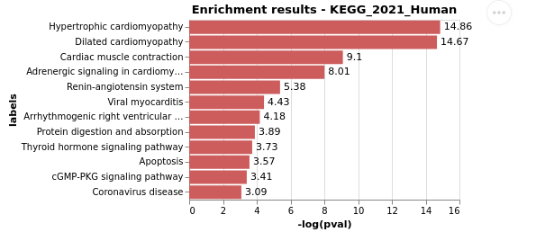
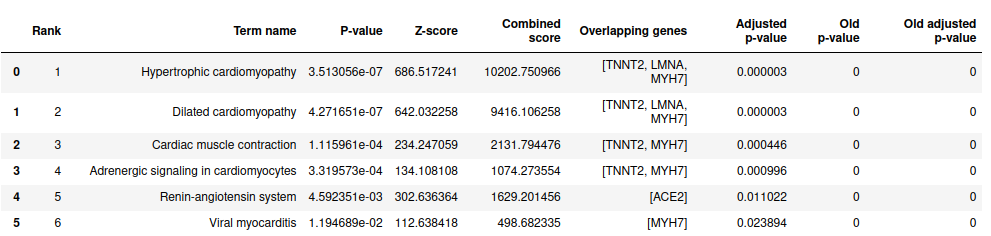

EnrichR
============

EnrichR API allows to extract information about pathways, transcription and drugs associated to a list of genes or to a single gene.

Import enrich_omics and EnrichR in your file and choose the library you want to use for enrichment. You can check all the 192 libraries available as below.

.. code:: python

	import enrich_omics
	from enrich_omics import EnrichR

	# get all available libraries
	EnrichR.get_libraries()

Once you have selected the library you want to use (default library is KEGG_human_2021), you can see the enrichment results as plot or table. Enrichment scores calculated as -log10(pval).

.. code:: python

	# get enrichment for a list of genes/proteins
	# default library is 'KEGG_2021_Human' but other libraries can be 	 
	# specified using the 'library_name' argument.
	# check out available libraries with the command above
	
	# 'max_hits' allows users to change the number of hits displayed in the plot
	# 'height' and 'width' allow users to change the size of the plot
	#  all arguments are optional apart from 'gene_list'
	
	gene_list = ['LMNA', 'MYH7', 'TNNT2', 'ACE2']
	EnrichR.plot_enrichment(gene_list, height = 200, width = 300, max_hits = 12)

	
Get the results of enrichment in a dataframe and use it for downstream analysis. The dataframe contains information about the term names associated to the given targets, the p-value, z-score, combined score, overlapping genes and adjusted p-value.
	
.. code:: python

	# get results as table for downstream analysis/ pipeline integration
	EnrichR.get_table_enrichment(['LMNA', 'MYH7', 'TNNT2', 'ACE2'])
	
	

