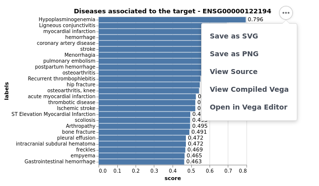
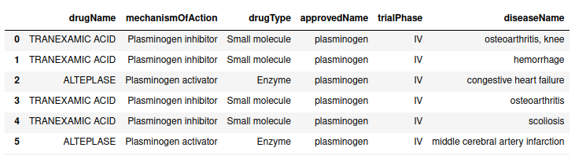
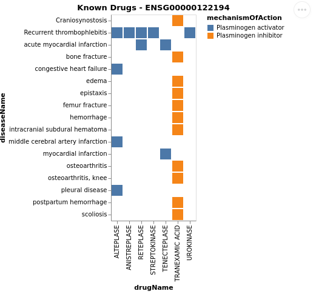
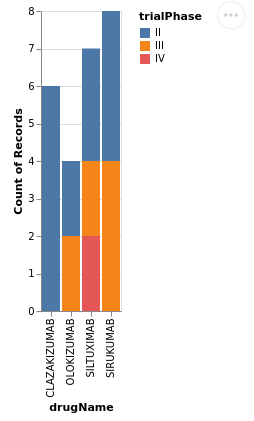
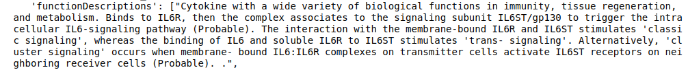

OpenTargets API
===============

The OpenTargets API allows to extract information about drugs and diseases associated to a single target (either a gene or a disease). Currently OpenTargets only supports single queries.

Target endpoint
***************

To plot the diseases associated to a target (i.e. PLG) you can use the **plot_diseases** function that takes as input either an Ensemble ID or an Entrez gene ID. To use Entrez IDs set entrez = True. You can also specify the max hits you want to show, as well as the height and width of the plot.

.. code:: python

	# OpenTargets takes EnsembleIDs by default, but entrez ids can be 
	# passed using the argument entrez = True
	# Export plots easily in png or svg
	OpenTargets.plot_diseases(target_id = 'PLG', entrez = True) 
	

Results can also be returned as dictionary.

.. code:: python
	
	OpenTargets.get_associated_diseases(target_id = 'ACE2', entrez = True)

Users can get table with the **drugs associated to a particular target** and use it for downstream analysis. The table will show information about the drug name, mechanism of action, drug type, approved name, the trial phase the drug is involved in and the diseases that are associated to those targets and drugs.

.. code:: python

	OpenTargets.get_table_drugs(target_id = 'PLG', entrez = True)
	

The results can be visualised and exported as png or svg.

.. code:: python

	# Plot drugs and diseases associated to a given target
	OpenTargets.plot_drugs_disease(target_id = 'PLG', entrez = True)
	

	
	
	
Information about **trial phases** can also be plotted and exported

.. code:: python
	
	plotDrugsPhase(target_id = "ENSG00000136244")
	
	

Get a description of the biological function
---------------------------------------------

Get a description of the **biological function** of a target of interest. This function returns a dictionary with the target Ensemble ID, the approved symbol, the biotype and a function description.

.. code:: python
	
	OpenTargets.function_description("ENSG00000136244")

Below an example of function description retrieved from Open Targets

	

 

